# FUEP Post-UTME Portal - Sequence Diagrams

This document contains sequence diagrams that illustrate the key workflows and interactions within the FUEP Post-UTME Portal system.

## 📋 **Table of Contents**

1. [Candidate Registration Flow](#candidate-registration-flow)
2. [Payment Processing Flow](#payment-processing-flow)
3. [Admin Management Flow](#admin-management-flow)
4. [Document Management Flow](#document-management-flow)
5. [Email Service Integration](#email-service-integration)
6. [Authentication Flow](#authentication-flow)

---

## 🎓 **Candidate Registration Flow**

### **Step 1 — Apply & Verify JAMB Number**

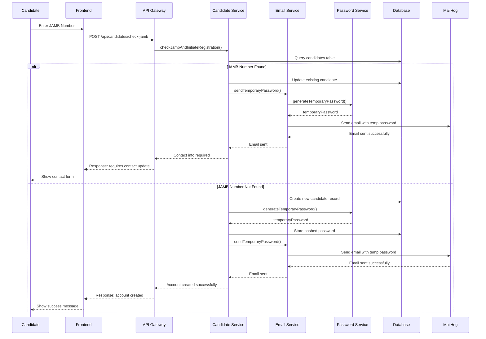
```mermaid
sequenceDiagram
    participant C as Candidate
    participant F as Frontend
    participant A as API Gateway
    participant CS as Candidate Service
    participant ES as Email Service
    participant PS as Password Service
    participant DB as Database
    participant M as MailHog

    C->>F: Enter JAMB Number
    F->>A: POST /api/candidates/check-jamb
    A->>CS: checkJambAndInitiateRegistration()

    CS->>DB: Query candidates table
    alt JAMB Number Found
        CS->>DB: Update existing candidate
        CS->>ES: sendTemporaryPassword()
        ES->>PS: generateTemporaryPassword()
        PS-->>ES: temporaryPassword
        ES->>M: Send email with temp password
        M-->>ES: Email sent successfully
        ES-->>CS: Email sent
        CS-->>A: Contact info required
        A-->>F: Response: requires contact update
        F-->>C: Show contact form
    else JAMB Number Not Found
        CS->>DB: Create new candidate record
        CS->>PS: generateTemporaryPassword()
        PS-->>CS: temporaryPassword
        CS->>DB: Store hashed password
        CS->>ES: sendTemporaryPassword()
        ES->>M: Send email with temp password
        M-->>ES: Email sent successfully
        ES-->>CS: Email sent
        CS-->>A: Account created successfully
        A-->>F: Response: account created
        F-->>C: Show success message
    end
```

### **Step 2 — Initiate Post-UTME Payment & Account Creation**

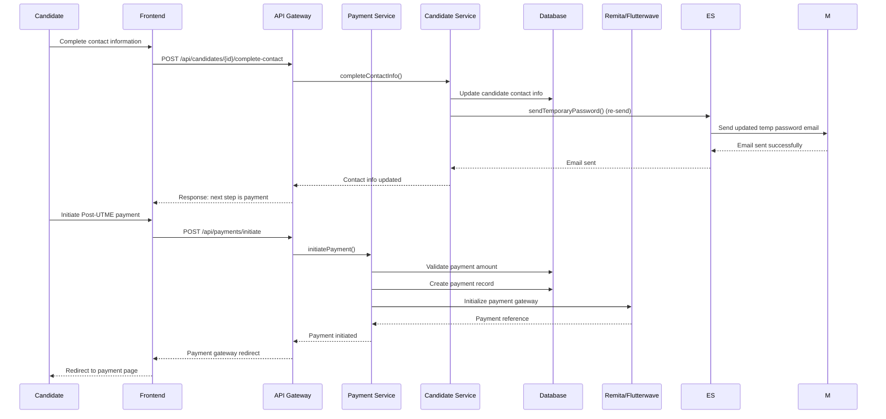
```mermaid
sequenceDiagram
    participant C as Candidate
    participant F as Frontend
    participant A as API Gateway
    participant PS as Payment Service
    participant CS as Candidate Service
    participant DB as Database
    participant R as Remita/Flutterwave

    C->>F: Complete contact information
    F->>A: POST /api/candidates/{id}/complete-contact
    A->>CS: completeContactInfo()

    CS->>DB: Update candidate contact info
    CS->>ES: sendTemporaryPassword() (re-send)
    ES->>M: Send updated temp password email
    M-->>ES: Email sent successfully
    ES-->>CS: Email sent
    CS-->>A: Contact info updated
    A-->>F: Response: next step is payment

    C->>F: Initiate Post-UTME payment
    F->>A: POST /api/payments/initiate
    A->>PS: initiatePayment()

    PS->>DB: Validate payment amount
    PS->>DB: Create payment record
    PS->>R: Initialize payment gateway
    R-->>PS: Payment reference
    PS-->>A: Payment initiated
    A-->>F: Payment gateway redirect
    F-->>C: Redirect to payment page
```

### **Step 3 — Payment Confirmation & Account Activation**

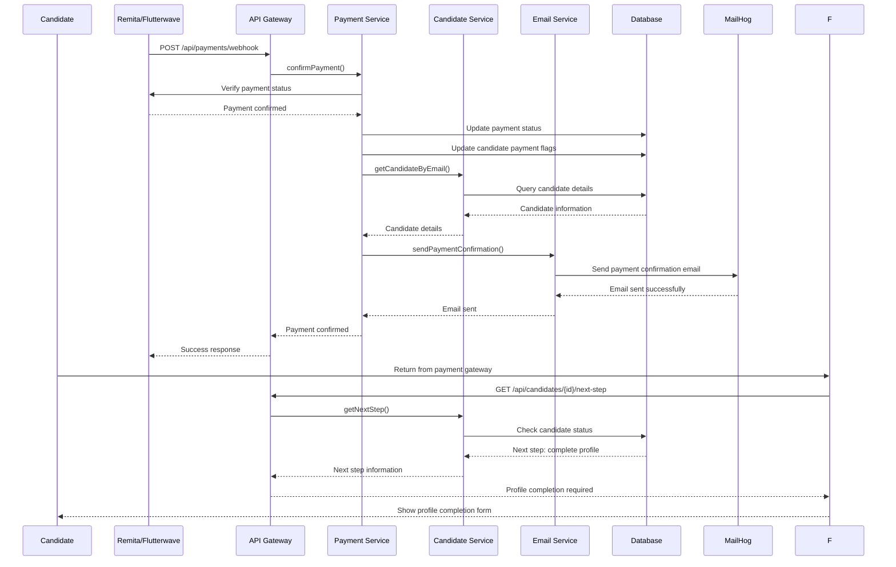
```mermaid
sequenceDiagram
    participant C as Candidate
    participant R as Remita/Flutterwave
    participant A as API Gateway
    participant PS as Payment Service
    participant CS as Candidate Service
    participant ES as Email Service
    participant DB as Database
    participant M as MailHog

    R->>A: POST /api/payments/webhook
    A->>PS: confirmPayment()

    PS->>R: Verify payment status
    R-->>PS: Payment confirmed
    PS->>DB: Update payment status
    PS->>DB: Update candidate payment flags
    PS->>CS: getCandidateByEmail()
    CS->>DB: Query candidate details
    DB-->>CS: Candidate information
    CS-->>PS: Candidate details
    PS->>ES: sendPaymentConfirmation()
    ES->>M: Send payment confirmation email
    M-->>ES: Email sent successfully
    ES-->>PS: Email sent
    PS-->>A: Payment confirmed
    A-->>R: Success response

    C->>F: Return from payment gateway
    F->>A: GET /api/candidates/{id}/next-step
    A->>CS: getNextStep()
    CS->>DB: Check candidate status
    DB-->>CS: Next step: complete profile
    CS-->>A: Next step information
    A-->>F: Profile completion required
    F-->>C: Show profile completion form
```

### **Step 4 — Progressive Profile Completion**

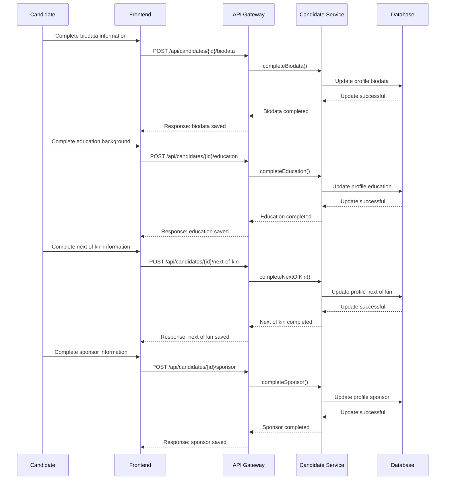
```mermaid
sequenceDiagram
    participant C as Candidate
    participant F as Frontend
    participant A as API Gateway
    participant CS as Candidate Service
    participant DB as Database

    C->>F: Complete biodata information
    F->>A: POST /api/candidates/{id}/biodata
    A->>CS: completeBiodata()
    CS->>DB: Update profile biodata
    DB-->>CS: Update successful
    CS-->>A: Biodata completed
    A-->>F: Response: biodata saved

    C->>F: Complete education background
    F->>A: POST /api/candidates/{id}/education
    A->>CS: completeEducation()
    CS->>DB: Update profile education
    DB-->>CS: Update successful
    CS-->>A: Education completed
    A-->>F: Response: education saved

    C->>F: Complete next of kin information
    F->>A: POST /api/candidates/{id}/next-of-kin
    A->>CS: completeNextOfKin()
    CS->>DB: Update profile next of kin
    DB-->>CS: Update successful
    CS-->>A: Next of kin completed
    A-->>F: Response: next of kin saved

    C->>F: Complete sponsor information
    F->>A: POST /api/candidates/{id}/sponsor
    A->>CS: completeSponsor()
    CS->>DB: Update profile sponsor
    DB-->>CS: Update successful
    CS-->>A: Sponsor completed
    A-->>F: Response: sponsor saved
```

### **Step 5 — Complete Candidate Registration Flow**

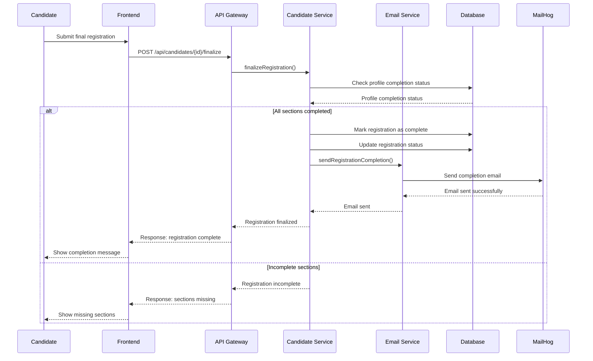
```mermaid
sequenceDiagram
    participant C as Candidate
    participant F as Frontend
    participant A as API Gateway
    participant CS as Candidate Service
    participant ES as Email Service
    participant DB as Database
    participant M as MailHog

    C->>F: Submit final registration
    F->>A: POST /api/candidates/{id}/finalize
    A->>CS: finalizeRegistration()

    CS->>DB: Check profile completion status
    DB-->>CS: Profile completion status
    alt All sections completed
        CS->>DB: Mark registration as complete
        CS->>DB: Update registration status
        CS->>ES: sendRegistrationCompletion()
        ES->>M: Send completion email
        M-->>ES: Email sent successfully
        ES-->>CS: Email sent
        CS-->>A: Registration finalized
        A-->>F: Response: registration complete
        F-->>C: Show completion message
    else Incomplete sections
        CS-->>A: Registration incomplete
        A-->>F: Response: sections missing
        F-->>C: Show missing sections
    end
```

---

## 💳 **Payment Processing Flow**

### **Payment Initiation & Processing**

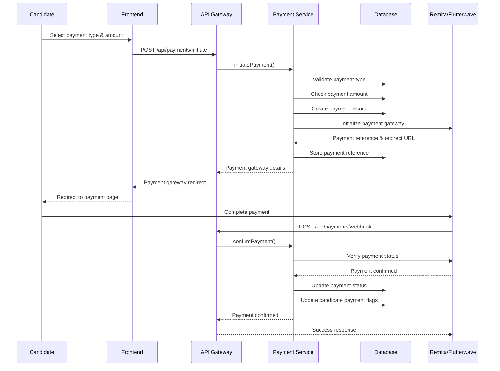
```mermaid
sequenceDiagram
    participant C as Candidate
    participant F as Frontend
    participant A as API Gateway
    participant PS as Payment Service
    participant DB as Database
    participant R as Remita/Flutterwave

    C->>F: Select payment type & amount
    F->>A: POST /api/payments/initiate
    A->>PS: initiatePayment()

    PS->>DB: Validate payment type
    PS->>DB: Check payment amount
    PS->>DB: Create payment record
    PS->>R: Initialize payment gateway
    R-->>PS: Payment reference & redirect URL
    PS->>DB: Store payment reference
    PS-->>A: Payment gateway details
    A-->>F: Payment gateway redirect
    F-->>C: Redirect to payment page

    C->>R: Complete payment
    R->>A: POST /api/payments/webhook
    A->>PS: confirmPayment()

    PS->>R: Verify payment status
    R-->>PS: Payment confirmed
    PS->>DB: Update payment status
    PS->>DB: Update candidate payment flags
    PS-->>A: Payment confirmed
    A-->>R: Success response
```

---

## 👨‍💼 **Admin Management Flow**

### **Admin Dashboard & Analytics**

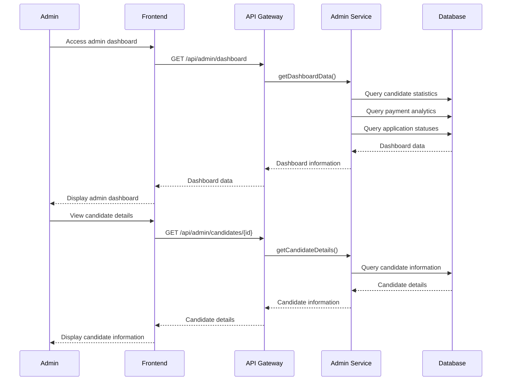
```mermaid
sequenceDiagram
    participant A as Admin
    participant F as Frontend
    participant API as API Gateway
    participant AS as Admin Service
    participant DB as Database

    A->>F: Access admin dashboard
    F->>API: GET /api/admin/dashboard
    API->>AS: getDashboardData()

    AS->>DB: Query candidate statistics
    AS->>DB: Query payment analytics
    AS->>DB: Query application statuses
    DB-->>AS: Dashboard data
    AS-->>API: Dashboard information
    API-->>F: Dashboard data
    F-->>A: Display admin dashboard

    A->>F: View candidate details
    F->>API: GET /api/admin/candidates/{id}
    API->>AS: getCandidateDetails()
    AS->>DB: Query candidate information
    DB-->>AS: Candidate details
    AS-->>API: Candidate information
    API-->>F: Candidate details
    F-->>A: Display candidate information
```

---

## 📄 **Document Management Flow**

### **Document Upload & Processing**

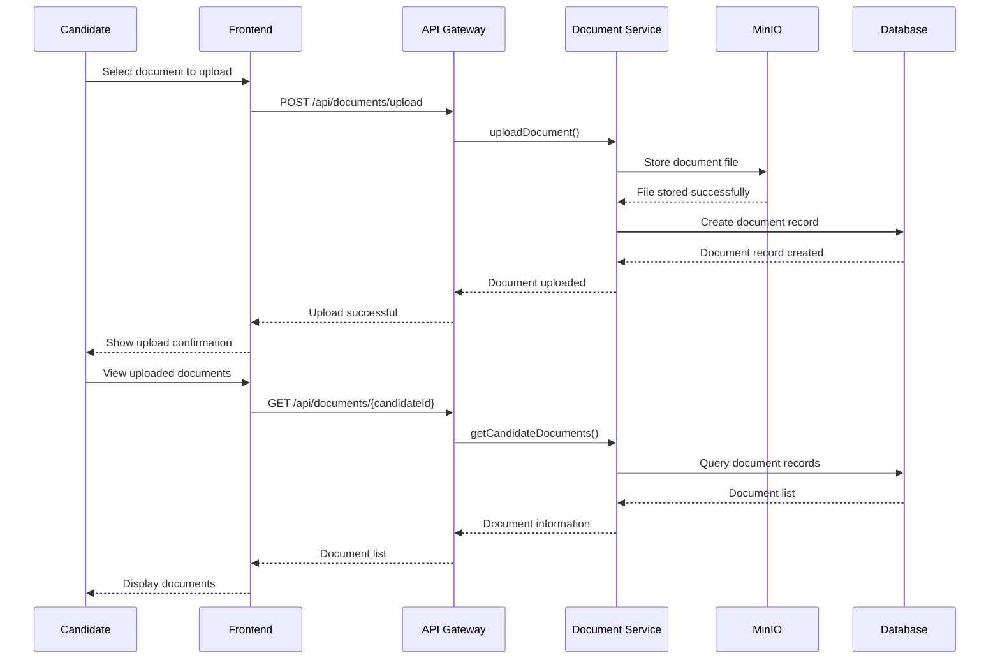
```mermaid
sequenceDiagram
    participant C as Candidate
    participant F as Frontend
    participant A as API Gateway
    participant DS as Document Service
    participant M as MinIO
    participant DB as Database

    C->>F: Select document to upload
    F->>A: POST /api/documents/upload
    A->>DS: uploadDocument()

    DS->>M: Store document file
    M-->>DS: File stored successfully
    DS->>DB: Create document record
    DB-->>DS: Document record created
    DS-->>A: Document uploaded
    A-->>F: Upload successful
    F-->>C: Show upload confirmation

    C->>F: View uploaded documents
    F->>A: GET /api/documents/{candidateId}
    A->>DS: getCandidateDocuments()
    DS->>DB: Query document records
    DB-->>DS: Document list
    DS-->>A: Document information
    A-->>F: Document list
    F-->>C: Display documents
```

---

## 📧 **Email Service & Temporary Password Flow**

### **Temporary Password Generation & Email Sending**

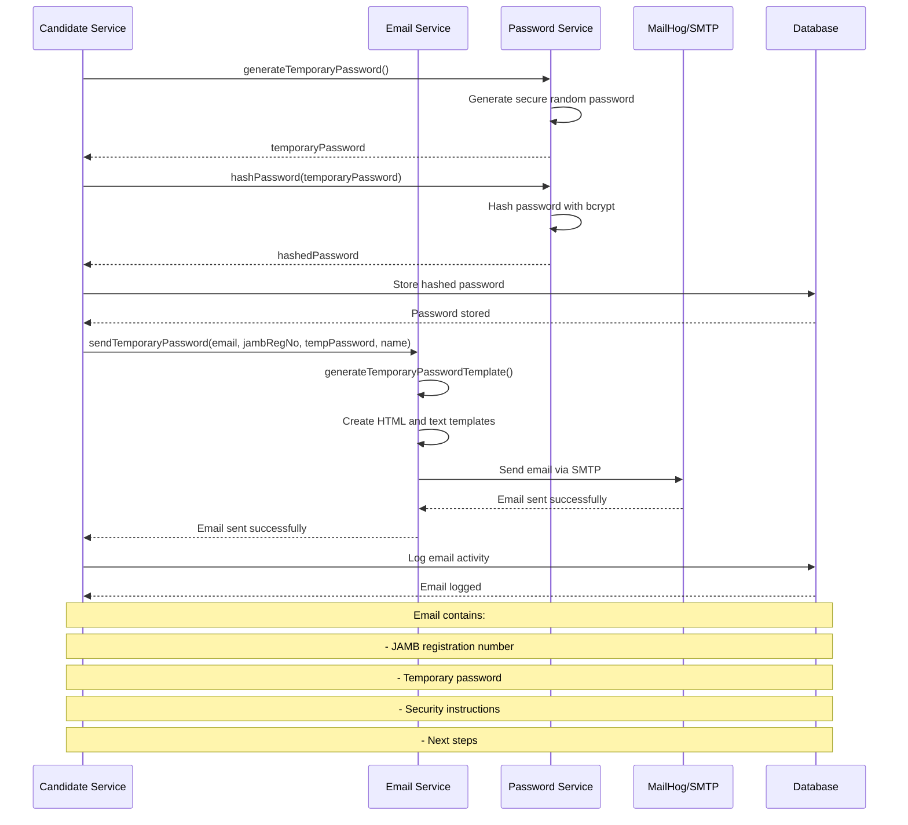
```mermaid
sequenceDiagram
    participant CS as Candidate Service
    participant ES as Email Service
    participant PS as Password Service
    participant M as MailHog/SMTP
    participant DB as Database

    CS->>PS: generateTemporaryPassword()
    PS->>PS: Generate secure random password
    PS-->>CS: temporaryPassword

    CS->>PS: hashPassword(temporaryPassword)
    PS->>PS: Hash password with bcrypt
    PS-->>CS: hashedPassword

    CS->>DB: Store hashed password
    DB-->>CS: Password stored

    CS->>ES: sendTemporaryPassword(email, jambRegNo, tempPassword, name)
    ES->>ES: generateTemporaryPasswordTemplate()
    ES->>ES: Create HTML and text templates

    ES->>M: Send email via SMTP
    M-->>ES: Email sent successfully

    ES-->>CS: Email sent successfully
    CS->>DB: Log email activity
    DB-->>CS: Email logged

    Note over CS,DB: Email contains:
    Note over CS,DB: - JAMB registration number
    Note over CS,DB: - Temporary password
    Note over CS,DB: - Security instructions
    Note over CS,DB: - Next steps
```

### **Payment Confirmation Email Flow**

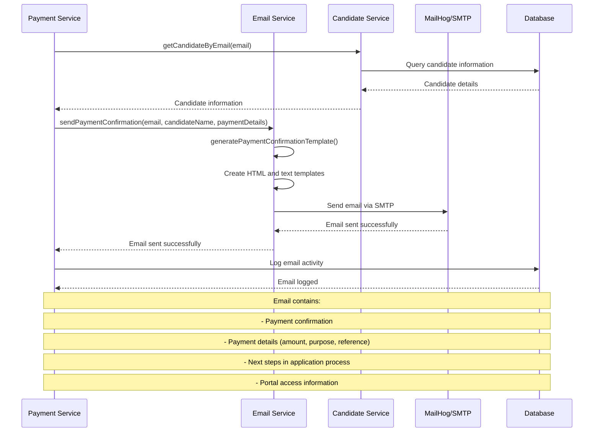
```mermaid
sequenceDiagram
    participant PS as Payment Service
    participant ES as Email Service
    participant CS as Candidate Service
    participant M as MailHog/SMTP
    participant DB as Database

    PS->>CS: getCandidateByEmail(email)
    CS->>DB: Query candidate information
    DB-->>CS: Candidate details
    CS-->>PS: Candidate information

    PS->>ES: sendPaymentConfirmation(email, candidateName, paymentDetails)
    ES->>ES: generatePaymentConfirmationTemplate()
    ES->>ES: Create HTML and text templates

    ES->>M: Send email via SMTP
    M-->>ES: Email sent successfully

    ES-->>PS: Email sent successfully
    PS->>DB: Log email activity
    DB-->>PS: Email logged

    Note over PS,DB: Email contains:
    Note over PS,DB: - Payment confirmation
    Note over PS,DB: - Payment details (amount, purpose, reference)
    Note over PS,DB: - Next steps in application process
    Note over PS,DB: - Portal access information
```

---

## 🔐 **Authentication Flow**

### **Candidate Login & Session Management**

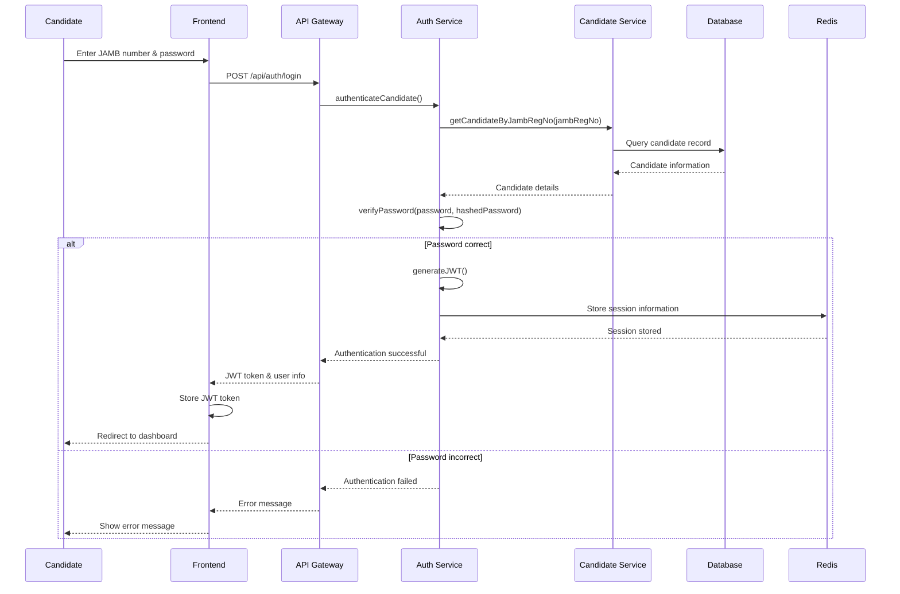
```mermaid
sequenceDiagram
    participant C as Candidate
    participant F as Frontend
    participant A as API Gateway
    participant AS as Auth Service
    participant CS as Candidate Service
    participant DB as Database
    participant R as Redis

    C->>F: Enter JAMB number & password
    F->>A: POST /api/auth/login
    A->>AS: authenticateCandidate()

    AS->>CS: getCandidateByJambRegNo(jambRegNo)
    CS->>DB: Query candidate record
    DB-->>CS: Candidate information
    CS-->>AS: Candidate details

    AS->>AS: verifyPassword(password, hashedPassword)
    alt Password correct
        AS->>AS: generateJWT()
        AS->>R: Store session information
        R-->>AS: Session stored
        AS-->>A: Authentication successful
        A-->>F: JWT token & user info
        F->>F: Store JWT token
        F-->>C: Redirect to dashboard
    else Password incorrect
        AS-->>A: Authentication failed
        A-->>F: Error message
        F-->>C: Show error message
    end
```

### **Password Change Flow**

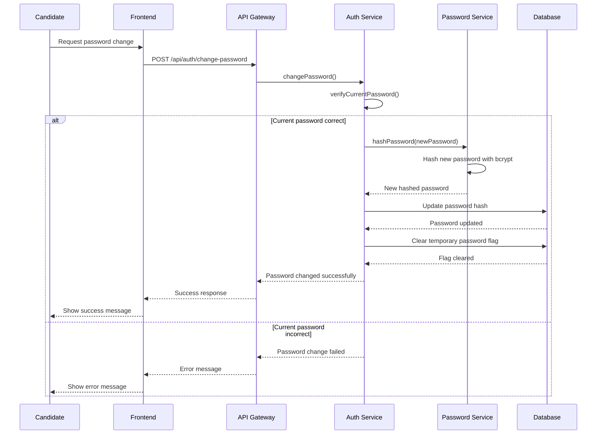
```mermaid
sequenceDiagram
    participant C as Candidate
    participant F as Frontend
    participant A as API Gateway
    participant AS as Auth Service
    participant PS as Password Service
    participant DB as Database

    C->>F: Request password change
    F->>A: POST /api/auth/change-password
    A->>AS: changePassword()

    AS->>AS: verifyCurrentPassword()
    alt Current password correct
        AS->>PS: hashPassword(newPassword)
        PS->>PS: Hash new password with bcrypt
        PS-->>AS: New hashed password

        AS->>DB: Update password hash
        DB-->>AS: Password updated
        AS->>DB: Clear temporary password flag
        DB-->>AS: Flag cleared

        AS-->>A: Password changed successfully
        A-->>F: Success response
        F-->>C: Show success message
    else Current password incorrect
        AS-->>A: Password change failed
        A-->>F: Error message
        F-->>C: Show error message
    end
```

---

## 🔍 **Advanced Analytics & Reporting Flow**

### **Admin Analytics Dashboard**

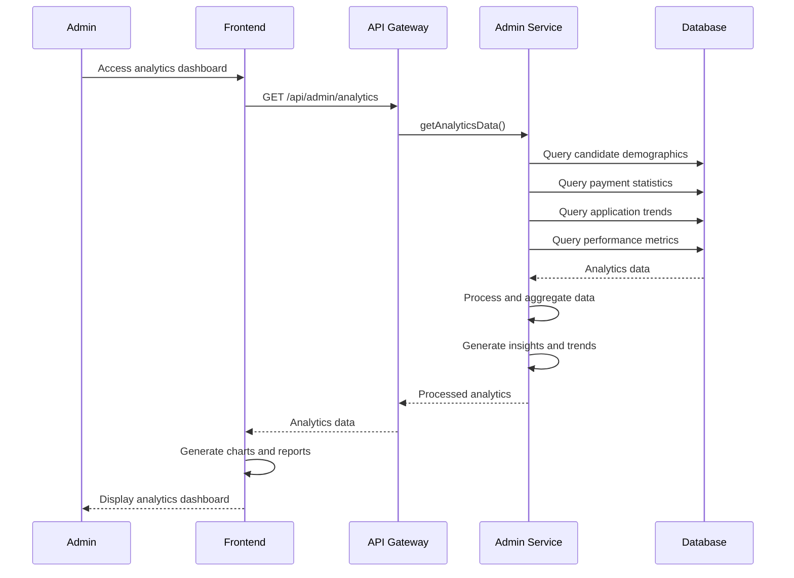
```mermaid
sequenceDiagram
    participant A as Admin
    participant F as Frontend
    participant API as API Gateway
    participant AS as Admin Service
    participant DB as Database

    A->>F: Access analytics dashboard
    F->>API: GET /api/admin/analytics
    API->>AS: getAnalyticsData()

    AS->>DB: Query candidate demographics
    AS->>DB: Query payment statistics
    AS->>DB: Query application trends
    AS->>DB: Query performance metrics
    DB-->>AS: Analytics data

    AS->>AS: Process and aggregate data
    AS->>AS: Generate insights and trends
    AS-->>API: Processed analytics
    API-->>F: Analytics data
    F->>F: Generate charts and reports
    F-->>A: Display analytics dashboard
```

---

## 📊 **Audit Logging & Security Monitoring**

### **Comprehensive Audit Trail**

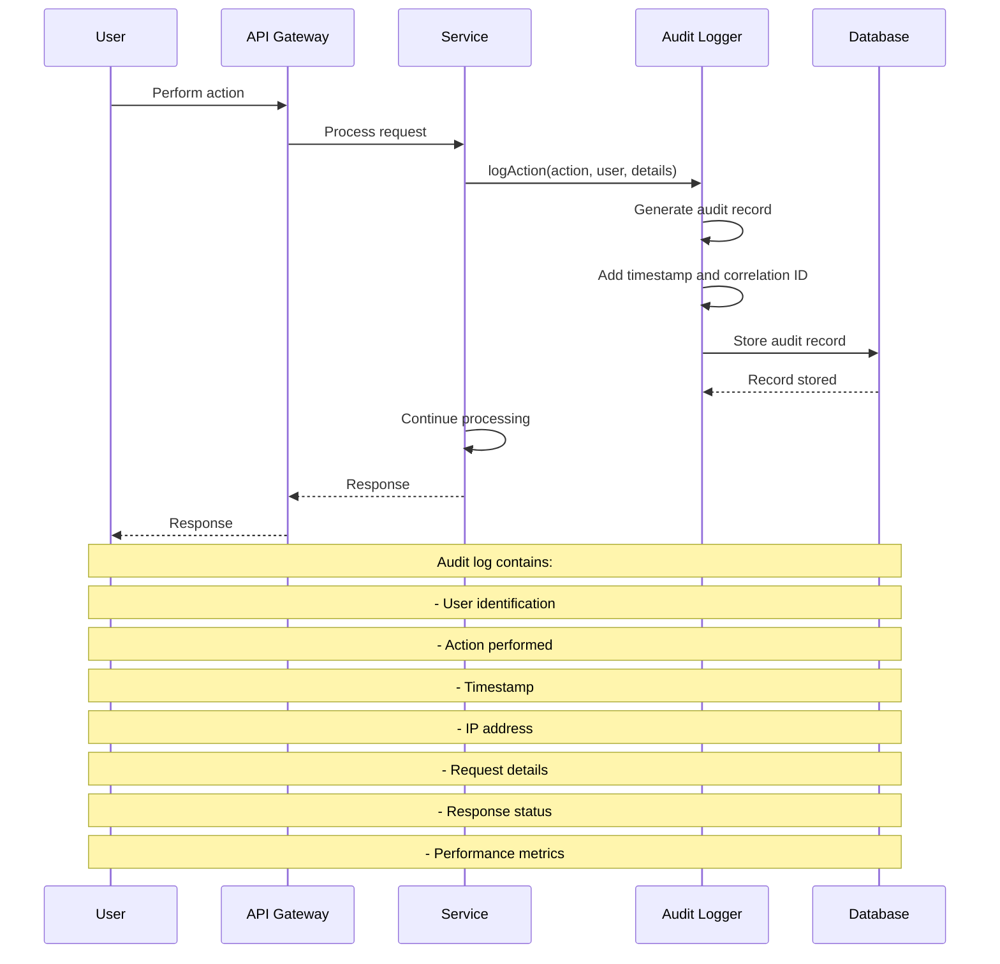
```mermaid
sequenceDiagram
    participant U as User
    participant A as API Gateway
    participant S as Service
    participant AL as Audit Logger
    participant DB as Database

    U->>A: Perform action
    A->>S: Process request

    S->>AL: logAction(action, user, details)
    AL->>AL: Generate audit record
    AL->>AL: Add timestamp and correlation ID
    AL->>DB: Store audit record
    DB-->>AL: Record stored

    S->>S: Continue processing
    S-->>A: Response
    A-->>U: Response

    Note over U,DB: Audit log contains:
    Note over U,DB: - User identification
    Note over U,DB: - Action performed
    Note over U,DB: - Timestamp
    Note over U,DB: - IP address
    Note over U,DB: - Request details
    Note over U,DB: - Response status
    Note over U,DB: - Performance metrics
```

---

## 🚀 **System Health & Monitoring Flow**

### **Health Check & Service Monitoring**

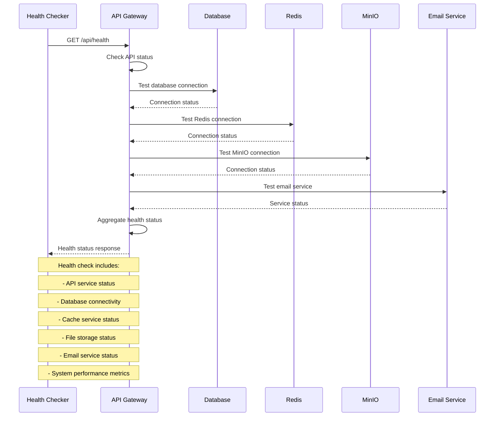
```mermaid
sequenceDiagram
    participant H as Health Checker
    participant A as API Gateway
    participant DB as Database
    participant R as Redis
    participant M as MinIO
    participant E as Email Service

    H->>A: GET /api/health
    A->>A: Check API status
    A->>DB: Test database connection
    DB-->>A: Connection status
    A->>R: Test Redis connection
    R-->>A: Connection status
    A->>M: Test MinIO connection
    M-->>A: Connection status
    A->>E: Test email service
    E-->>A: Service status

    A->>A: Aggregate health status
    A-->>H: Health status response

    Note over H,A: Health check includes:
    Note over H,A: - API service status
    Note over H,A: - Database connectivity
    Note over H,A: - Cache service status
    Note over H,A: - File storage status
    Note over H,A: - Email service status
    Note over H,A: - System performance metrics
```

---

## 📱 **Mobile Application Integration Flow**

### **Mobile App Authentication & Sync**

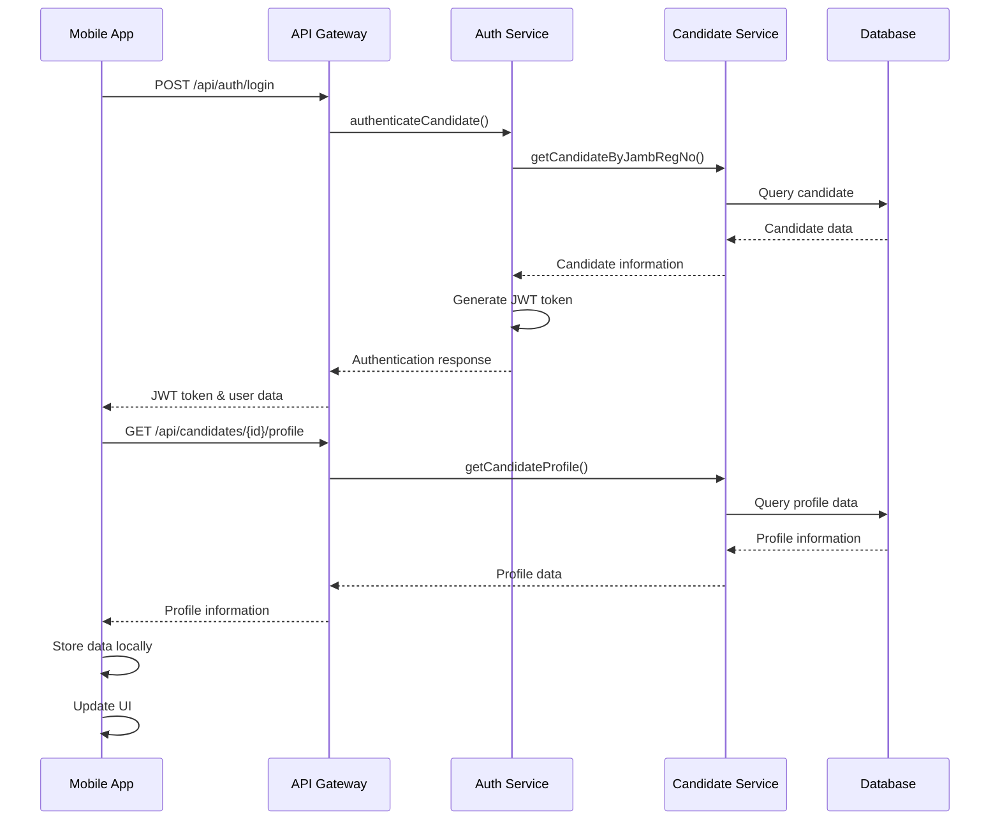
```mermaid
sequenceDiagram
    participant M as Mobile App
    participant A as API Gateway
    participant AS as Auth Service
    participant CS as Candidate Service
    participant DB as Database

    M->>A: POST /api/auth/login
    A->>AS: authenticateCandidate()
    AS->>CS: getCandidateByJambRegNo()
    CS->>DB: Query candidate
    DB-->>CS: Candidate data
    CS-->>AS: Candidate information
    AS->>AS: Generate JWT token
    AS-->>A: Authentication response
    A-->>M: JWT token & user data

    M->>A: GET /api/candidates/{id}/profile
    A->>CS: getCandidateProfile()
    CS->>DB: Query profile data
    DB-->>CS: Profile information
    CS-->>A: Profile data
    A-->>M: Profile information

    M->>M: Store data locally
    M->>M: Update UI
```

---

## 🔄 **Real-time Updates & Notifications**

### **WebSocket Integration for Live Updates**

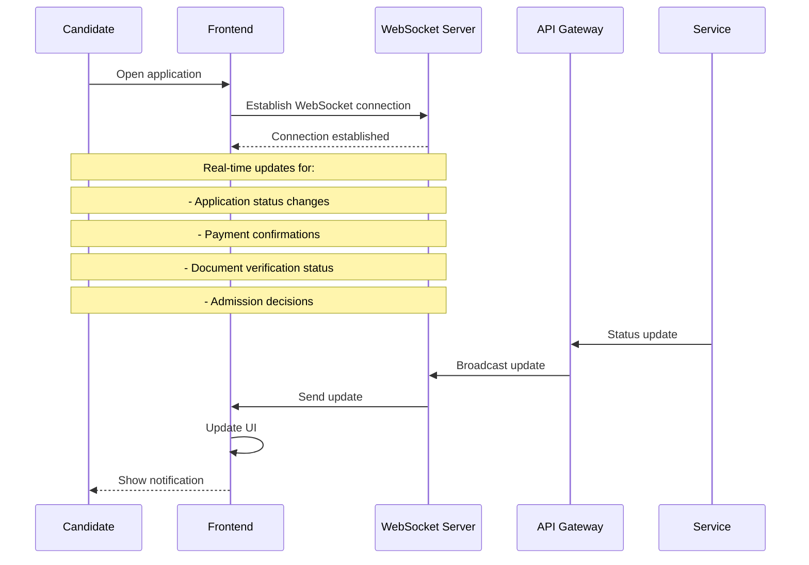
```mermaid
sequenceDiagram
    participant C as Candidate
    participant F as Frontend
    participant WS as WebSocket Server
    participant A as API Gateway
    participant S as Service

    C->>F: Open application
    F->>WS: Establish WebSocket connection
    WS-->>F: Connection established

    Note over C,WS: Real-time updates for:
    Note over C,WS: - Application status changes
    Note over C,WS: - Payment confirmations
    Note over C,WS: - Document verification status
    Note over C,WS: - Admission decisions

    S->>A: Status update
    A->>WS: Broadcast update
    WS->>F: Send update
    F->>F: Update UI
    F-->>C: Show notification
```

---

_These sequence diagrams represent the current implementation of the FUEP Post-UTME Portal as of August 2025. The system includes comprehensive email integration, advanced candidate management, and robust security features._
