# FUEP Post-UTME — Sequence Diagrams (Mermaid)

These sequence diagrams are normative and must inform and constrain implementation throughout development. Any deviation must be explicitly reviewed and approved.

## Conformance Notes

- All API contracts, database operations, background jobs, and side effects must follow these flows.
- Payment orchestration (init, webhook, verify, reconcile) must match the steps and transitions depicted here.
- Candidate lifecycle, document processing, admissions, matriculation, and migration are governed by these sequences.
- Admin module operations must follow the authentication, authorization, and audit flows specified here.

---

## Step 1 — Apply & Verify JAMB Number

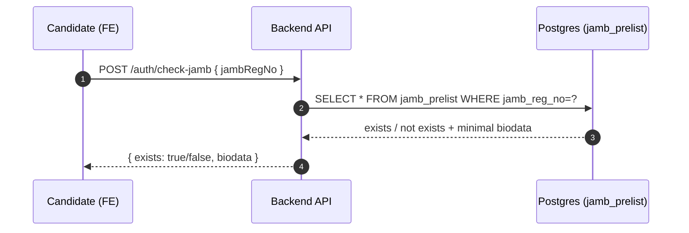
```mermaid
sequenceDiagram
  autonumber
  participant U as Candidate (FE)
  participant API as Backend API
  participant DB as Postgres (jamb_prelist)

  U->>API: POST /auth/check-jamb { jambRegNo }
  API->>DB: SELECT * FROM jamb_prelist WHERE jamb_reg_no=?
  DB-->>API: exists / not exists + minimal biodata
  API-->>U: { exists: true/false, biodata }
```

---

## Step 2 — Initiate Post-UTME Payment

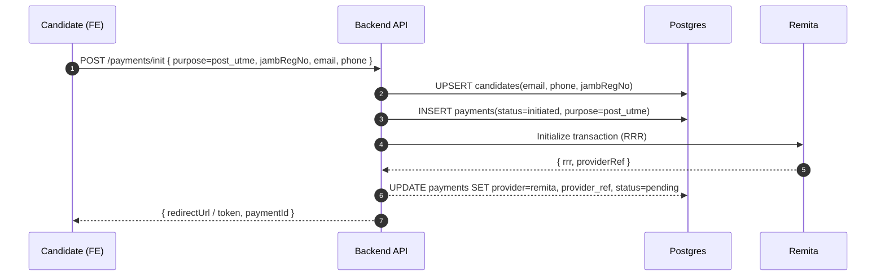
```mermaid
sequenceDiagram
  autonumber
  participant U as Candidate (FE)
  participant API as Backend API
  participant DB as Postgres
  participant REM as Remita

  U->>API: POST /payments/init { purpose=post_utme, jambRegNo, email, phone }
  API->>DB: UPSERT candidates(email, phone, jambRegNo)
  API->>DB: INSERT payments(status=initiated, purpose=post_utme)
  API->>REM: Initialize transaction (RRR)
  REM-->>API: { rrr, providerRef }
  API-->>DB: UPDATE payments SET provider=remita, provider_ref, status=pending
  API-->>U: { redirectUrl / token, paymentId }
```

---

## Step 3 — Payment Confirmation & Account Creation

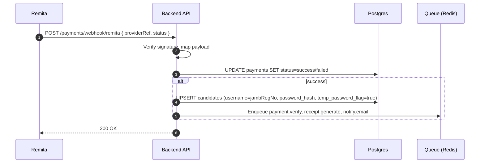
```mermaid
sequenceDiagram
  autonumber
  participant REM as Remita
  participant API as Backend API
  participant DB as Postgres
  participant Q as Queue (Redis)

  REM->>API: POST /payments/webhook/remita { providerRef, status }
  API->>API: Verify signature, map payload
  API->>DB: UPDATE payments SET status=success/failed
  alt success
    API->>DB: UPSERT candidates (username=jambRegNo, password_hash, temp_password_flag=true)
    API->>Q: Enqueue payment.verify, receipt.generate, notify.email
  end
  API-->>REM: 200 OK
```

---

## Step 4 — Login & Password Change Prompt

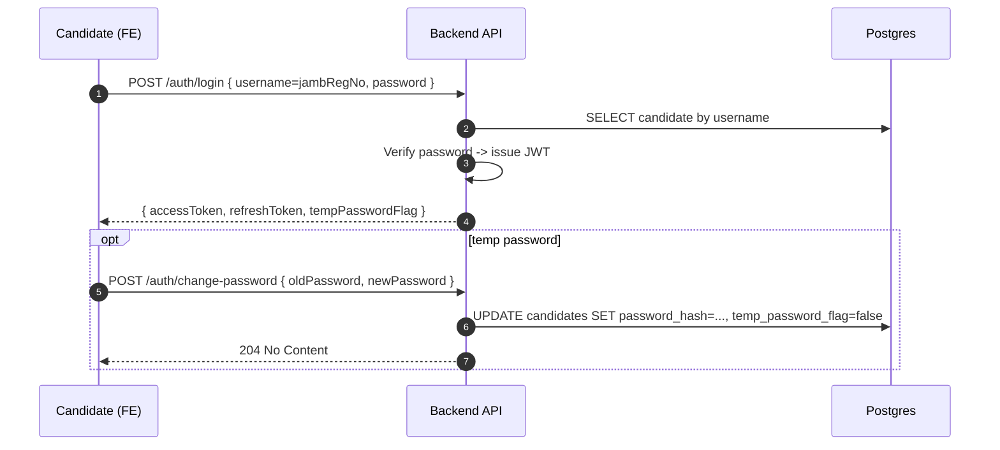
```mermaid
sequenceDiagram
  autonumber
  participant U as Candidate (FE)
  participant API as Backend API
  participant DB as Postgres

  U->>API: POST /auth/login { username=jambRegNo, password }
  API->>DB: SELECT candidate by username
  API->>API: Verify password -> issue JWT
  API-->>U: { accessToken, refreshToken, tempPasswordFlag }
  opt temp password
    U->>API: POST /auth/change-password { oldPassword, newPassword }
    API->>DB: UPDATE candidates SET password_hash=..., temp_password_flag=false
    API-->>U: 204 No Content
  end
```

---

## Step 5 — Biodata Form

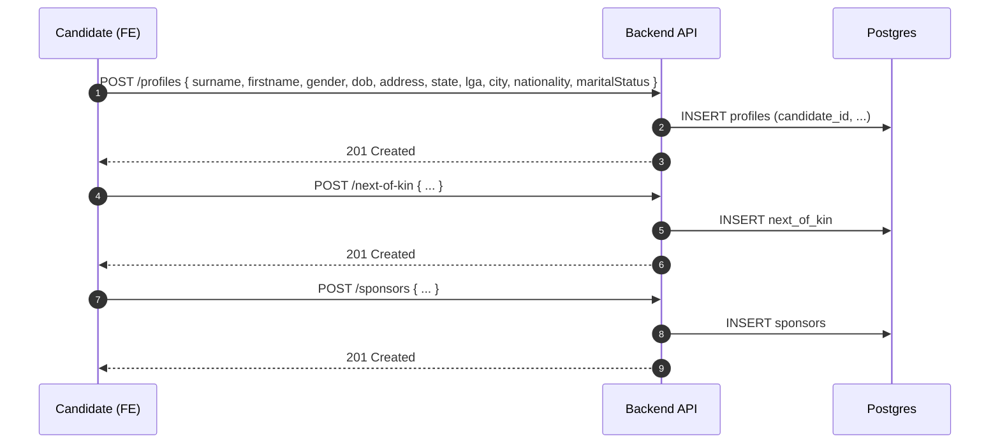
```mermaid
sequenceDiagram
  autonumber
  participant U as Candidate (FE)
  participant API as Backend API
  participant DB as Postgres

  U->>API: POST /profiles { surname, firstname, gender, dob, address, state, lga, city, nationality, maritalStatus }
  API->>DB: INSERT profiles (candidate_id, ...)
  API-->>U: 201 Created

  U->>API: POST /next-of-kin { ... }
  API->>DB: INSERT next_of_kin
  API-->>U: 201 Created

  U->>API: POST /sponsors { ... }
  API->>DB: INSERT sponsors
  API-->>U: 201 Created
```

---

## Step 6 — Document Uploads

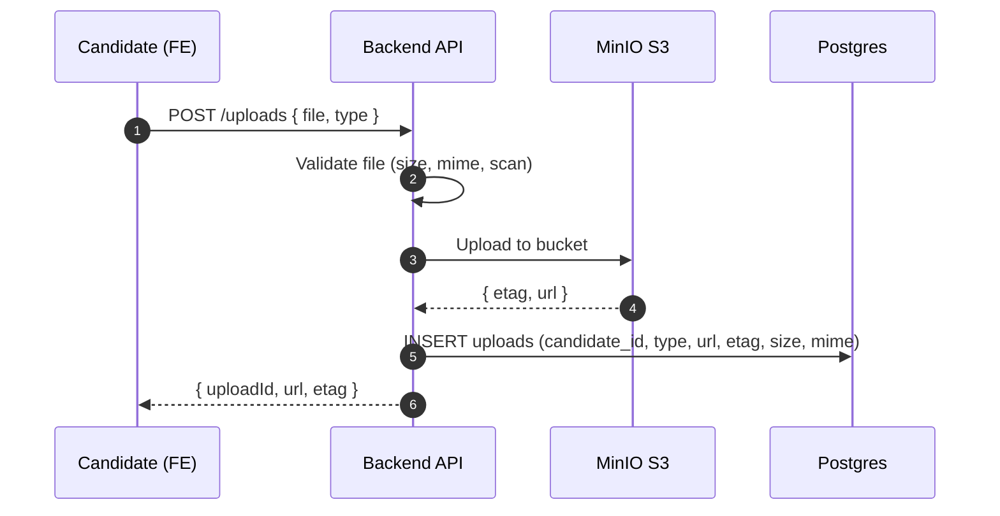
```mermaid
sequenceDiagram
  autonumber
  participant U as Candidate (FE)
  participant API as Backend API
  participant MINIO as MinIO S3
  participant DB as Postgres

  U->>API: POST /uploads { file, type }
  API->>API: Validate file (size, mime, scan)
  API->>MINIO: Upload to bucket
  MINIO-->>API: { etag, url }
  API->>DB: INSERT uploads (candidate_id, type, url, etag, size, mime)
  API-->>U: { uploadId, url, etag }
```

---

## Step 7 — Application Submission

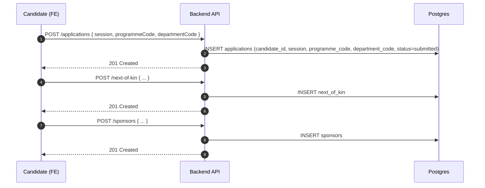
```mermaid
sequenceDiagram
  autonumber
  participant U as Candidate (FE)
  participant API as Backend API
  participant DB as Postgres

  U->>API: POST /applications { session, programmeCode, departmentCode }
  API->>DB: INSERT applications (candidate_id, session, programme_code, department_code, status=submitted)
  API-->>U: 201 Created

  U->>API: POST /next-of-kin { ... }
  API->>DB: INSERT next_of_kin
  API-->>U: 201 Created

  U->>API: POST /sponsors { ... }
  API->>DB: INSERT sponsors
  API-->>U: 201 Created
```

---

## Step 8 — Registration Form Preview & Print

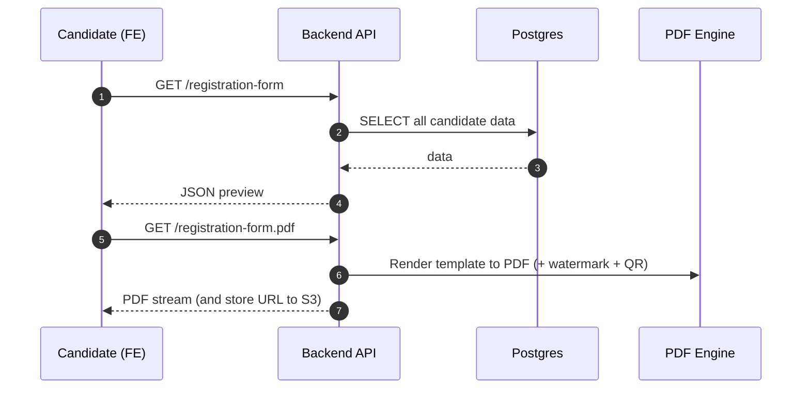
```mermaid
sequenceDiagram
  autonumber
  participant U as Candidate (FE)
  participant API as Backend API
  participant DB as Postgres
  participant PDF as PDF Engine

  U->>API: GET /registration-form
  API->>DB: SELECT all candidate data
  DB-->>API: data
  API-->>U: JSON preview

  U->>API: GET /registration-form.pdf
  API->>PDF: Render template to PDF (+ watermark + QR)
  API-->>U: PDF stream (and store URL to S3)
```

---

## Step 9 — Candidate Dashboard

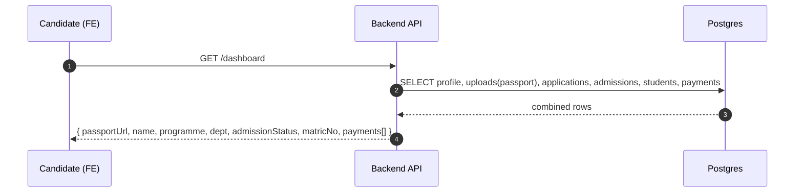
```mermaid
sequenceDiagram
  autonumber
  participant U as Candidate (FE)
  participant API as Backend API
  participant DB as Postgres

  U->>API: GET /dashboard
  API->>DB: SELECT profile, uploads(passport), applications, admissions, students, payments
  DB-->>API: combined rows
  API-->>U: { passportUrl, name, programme, dept, admissionStatus, matricNo, payments[] }
```

---

## Step 10 — Admission → Acceptance/School Fees → Matric → Letter → Migration

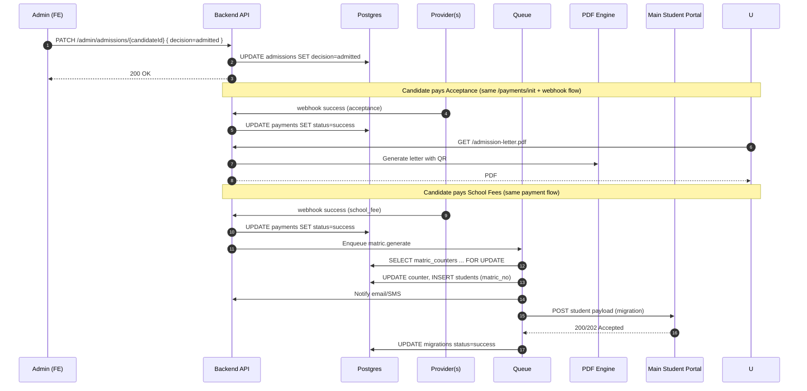
```mermaid
sequenceDiagram
  autonumber
  participant ADM as Admin (FE)
  participant API as Backend API
  participant DB as Postgres
  participant PAY as Provider(s)
  participant Q as Queue
  participant PDF as PDF Engine
  participant MAIN as Main Student Portal

  ADM->>API: PATCH /admin/admissions/{candidateId} { decision=admitted }
  API->>DB: UPDATE admissions SET decision=admitted
  API-->>ADM: 200 OK

  Note over U,API: Candidate pays Acceptance (same /payments/init + webhook flow)
  PAY->>API: webhook success (acceptance)
  API->>DB: UPDATE payments SET status=success

  U->>API: GET /admission-letter.pdf
  API->>PDF: Generate letter with QR
  API-->>U: PDF

  Note over U,API: Candidate pays School Fees (same payment flow)
  PAY->>API: webhook success (school_fee)
  API->>DB: UPDATE payments SET status=success
  API->>Q: Enqueue matric.generate

  Q->>DB: SELECT matric_counters ... FOR UPDATE
  Q->>DB: UPDATE counter, INSERT students (matric_no)
  Q->>API: Notify email/SMS

  Q->>MAIN: POST student payload (migration)
  MAIN-->>Q: 200/202 Accepted
  Q->>DB: UPDATE migrations status=success
```

---

## Admin Module — Authentication & Authorization

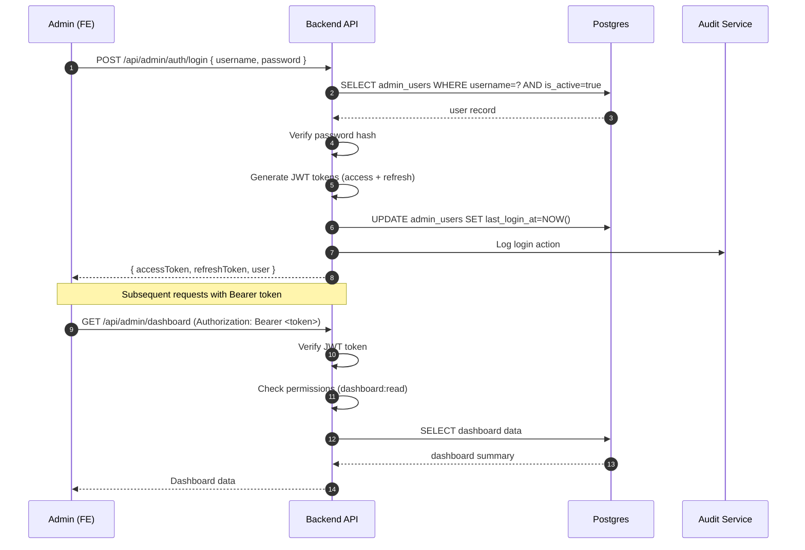
```mermaid
sequenceDiagram
  autonumber
  participant ADM as Admin (FE)
  participant API as Backend API
  participant DB as Postgres
  participant AUDIT as Audit Service

  ADM->>API: POST /api/admin/auth/login { username, password }
  API->>DB: SELECT admin_users WHERE username=? AND is_active=true
  DB-->>API: user record
  API->>API: Verify password hash
  API->>API: Generate JWT tokens (access + refresh)
  API->>DB: UPDATE admin_users SET last_login_at=NOW()
  API->>AUDIT: Log login action
  API-->>ADM: { accessToken, refreshToken, user }

  Note over ADM,API: Subsequent requests with Bearer token
  ADM->>API: GET /api/admin/dashboard (Authorization: Bearer <token>)
  API->>API: Verify JWT token
  API->>API: Check permissions (dashboard:read)
  API->>DB: SELECT dashboard data
  DB-->>API: dashboard summary
  API-->>ADM: Dashboard data
```

---

## Admin Module — Dashboard & Analytics

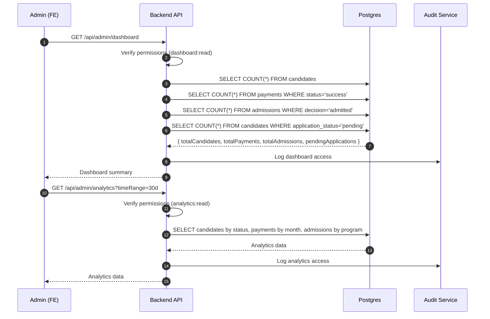
```mermaid
sequenceDiagram
  autonumber
  participant ADM as Admin (FE)
  participant API as Backend API
  participant DB as Postgres
  participant AUDIT as Audit Service

  ADM->>API: GET /api/admin/dashboard
  API->>API: Verify permissions (dashboard:read)
  API->>DB: SELECT COUNT(*) FROM candidates
  API->>DB: SELECT COUNT(*) FROM payments WHERE status='success'
  API->>DB: SELECT COUNT(*) FROM admissions WHERE decision='admitted'
  API->>DB: SELECT COUNT(*) FROM candidates WHERE application_status='pending'
  DB-->>API: { totalCandidates, totalPayments, totalAdmissions, pendingApplications }
  API->>AUDIT: Log dashboard access
  API-->>ADM: Dashboard summary

  ADM->>API: GET /api/admin/analytics?timeRange=30d
  API->>API: Verify permissions (analytics:read)
  API->>DB: SELECT candidates by status, payments by month, admissions by program
  DB-->>API: Analytics data
  API->>AUDIT: Log analytics access
  API-->>ADM: Analytics data
```

---

## Admin Module — User Management

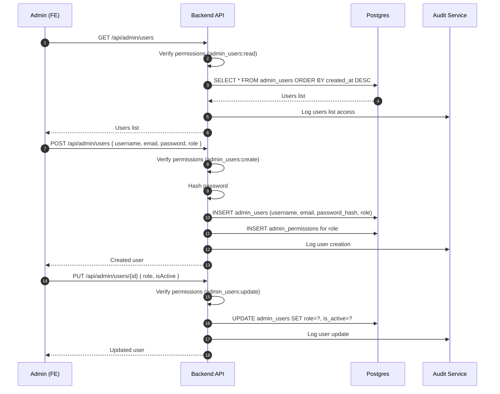
```mermaid
sequenceDiagram
  autonumber
  participant ADM as Admin (FE)
  participant API as Backend API
  participant DB as Postgres
  participant AUDIT as Audit Service

  ADM->>API: GET /api/admin/users
  API->>API: Verify permissions (admin_users:read)
  API->>DB: SELECT * FROM admin_users ORDER BY created_at DESC
  DB-->>API: Users list
  API->>AUDIT: Log users list access
  API-->>ADM: Users list

  ADM->>API: POST /api/admin/users { username, email, password, role }
  API->>API: Verify permissions (admin_users:create)
  API->>API: Hash password
  API->>DB: INSERT admin_users (username, email, password_hash, role)
  API->>DB: INSERT admin_permissions for role
  API->>AUDIT: Log user creation
  API-->>ADM: Created user

  ADM->>API: PUT /api/admin/users/{id} { role, isActive }
  API->>API: Verify permissions (admin_users:update)
  API->>DB: UPDATE admin_users SET role=?, is_active=?
  API->>AUDIT: Log user update
  API-->>ADM: Updated user
```

---

## Admin Module — Permissions Management

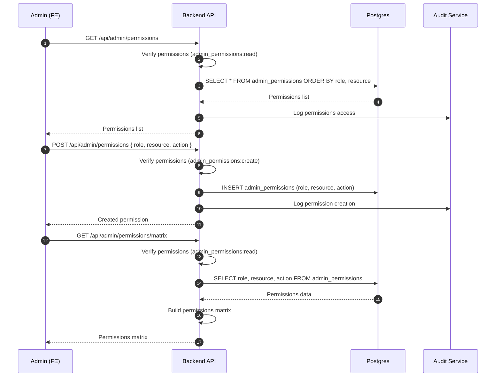
```mermaid
sequenceDiagram
  autonumber
  participant ADM as Admin (FE)
  participant API as Backend API
  participant DB as Postgres
  participant AUDIT as Audit Service

  ADM->>API: GET /api/admin/permissions
  API->>API: Verify permissions (admin_permissions:read)
  API->>DB: SELECT * FROM admin_permissions ORDER BY role, resource
  DB-->>API: Permissions list
  API->>AUDIT: Log permissions access
  API-->>ADM: Permissions list

  ADM->>API: POST /api/admin/permissions { role, resource, action }
  API->>API: Verify permissions (admin_permissions:create)
  API->>DB: INSERT admin_permissions (role, resource, action)
  API->>AUDIT: Log permission creation
  API-->>ADM: Created permission

  ADM->>API: GET /api/admin/permissions/matrix
  API->>API: Verify permissions (admin_permissions:read)
  API->>DB: SELECT role, resource, action FROM admin_permissions
  DB-->>API: Permissions data
  API->>API: Build permissions matrix
  API-->>ADM: Permissions matrix
```

---

## Admin Module — Candidate Management

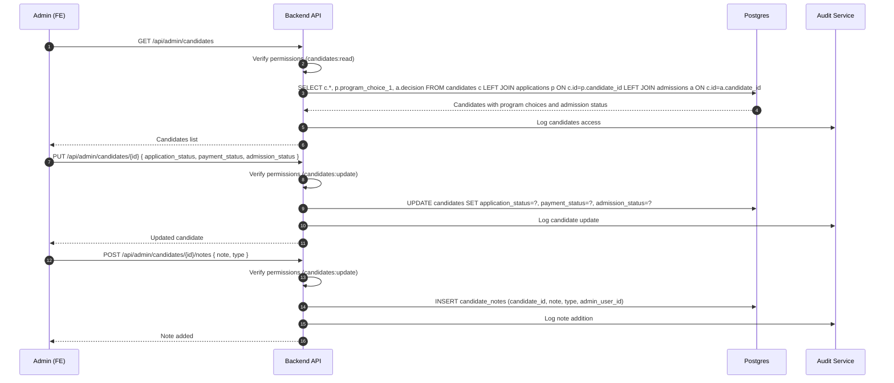
```mermaid
sequenceDiagram
  autonumber
  participant ADM as Admin (FE)
  participant API as Backend API
  participant DB as Postgres
  participant AUDIT as Audit Service

  ADM->>API: GET /api/admin/candidates
  API->>API: Verify permissions (candidates:read)
  API->>DB: SELECT c.*, p.program_choice_1, a.decision FROM candidates c LEFT JOIN applications p ON c.id=p.candidate_id LEFT JOIN admissions a ON c.id=a.candidate_id
  DB-->>API: Candidates with program choices and admission status
  API->>AUDIT: Log candidates access
  API-->>ADM: Candidates list

  ADM->>API: PUT /api/admin/candidates/{id} { application_status, payment_status, admission_status }
  API->>API: Verify permissions (candidates:update)
  API->>DB: UPDATE candidates SET application_status=?, payment_status=?, admission_status=?
  API->>AUDIT: Log candidate update
  API-->>ADM: Updated candidate

  ADM->>API: POST /api/admin/candidates/{id}/notes { note, type }
  API->>API: Verify permissions (candidates:update)
  API->>DB: INSERT candidate_notes (candidate_id, note, type, admin_user_id)
  API->>AUDIT: Log note addition
  API-->>ADM: Note added
```

---

## Admin Module — Payment Management

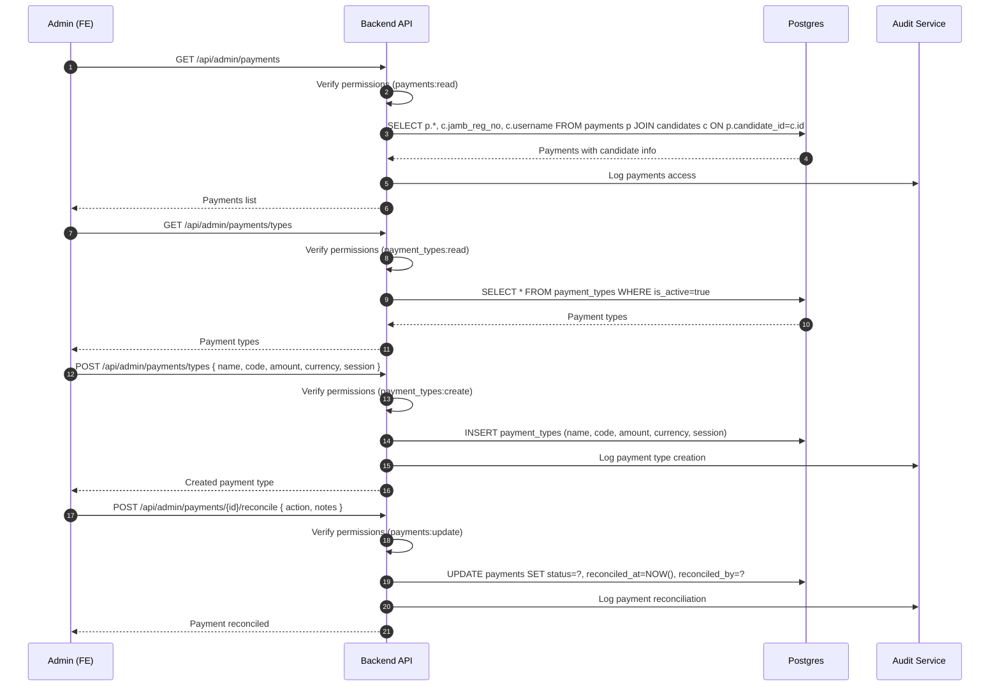
```mermaid
sequenceDiagram
  autonumber
  participant ADM as Admin (FE)
  participant API as Backend API
  participant DB as Postgres
  participant AUDIT as Audit Service

  ADM->>API: GET /api/admin/payments
  API->>API: Verify permissions (payments:read)
  API->>DB: SELECT p.*, c.jamb_reg_no, c.username FROM payments p JOIN candidates c ON p.candidate_id=c.id
  DB-->>API: Payments with candidate info
  API->>AUDIT: Log payments access
  API-->>ADM: Payments list

  ADM->>API: GET /api/admin/payments/types
  API->>API: Verify permissions (payment_types:read)
  API->>DB: SELECT * FROM payment_types WHERE is_active=true
  DB-->>API: Payment types
  API-->>ADM: Payment types

  ADM->>API: POST /api/admin/payments/types { name, code, amount, currency, session }
  API->>API: Verify permissions (payment_types:create)
  API->>DB: INSERT payment_types (name, code, amount, currency, session)
  API->>AUDIT: Log payment type creation
  API-->>ADM: Created payment type

  ADM->>API: POST /api/admin/payments/{id}/reconcile { action, notes }
  API->>API: Verify permissions (payments:update)
  API->>DB: UPDATE payments SET status=?, reconciled_at=NOW(), reconciled_by=?
  API->>AUDIT: Log payment reconciliation
  API-->>ADM: Payment reconciled
```

---

## Admin Module — Admissions Management

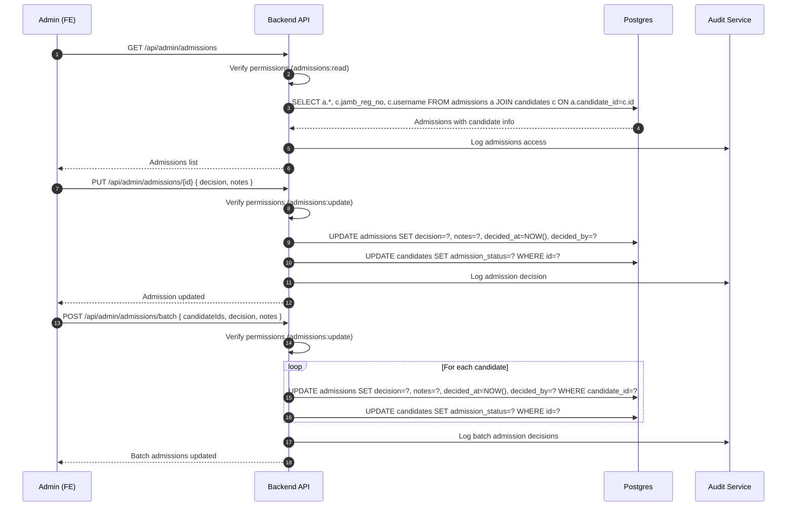
```mermaid
sequenceDiagram
  autonumber
  participant ADM as Admin (FE)
  participant API as Backend API
  participant DB as Postgres
  participant AUDIT as Audit Service

  ADM->>API: GET /api/admin/admissions
  API->>API: Verify permissions (admissions:read)
  API->>DB: SELECT a.*, c.jamb_reg_no, c.username FROM admissions a JOIN candidates c ON a.candidate_id=c.id
  DB-->>API: Admissions with candidate info
  API->>AUDIT: Log admissions access
  API-->>ADM: Admissions list

  ADM->>API: PUT /api/admin/admissions/{id} { decision, notes }
  API->>API: Verify permissions (admissions:update)
  API->>DB: UPDATE admissions SET decision=?, notes=?, decided_at=NOW(), decided_by=?
  API->>DB: UPDATE candidates SET admission_status=? WHERE id=?
  API->>AUDIT: Log admission decision
  API-->>ADM: Admission updated

  ADM->>API: POST /api/admin/admissions/batch { candidateIds, decision, notes }
  API->>API: Verify permissions (admissions:update)
  loop For each candidate
    API->>DB: UPDATE admissions SET decision=?, notes=?, decided_at=NOW(), decided_by=? WHERE candidate_id=?
    API->>DB: UPDATE candidates SET admission_status=? WHERE id=?
  end
  API->>AUDIT: Log batch admission decisions
  API-->>ADM: Batch admissions updated
```

---

## Admin Module — Reports Generation

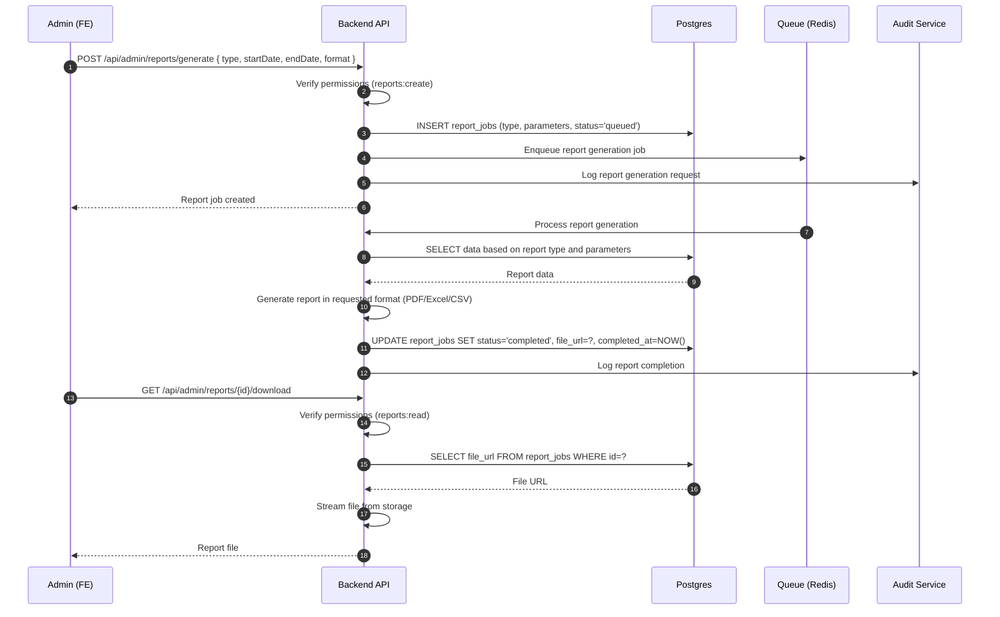
```mermaid
sequenceDiagram
  autonumber
  participant ADM as Admin (FE)
  participant API as Backend API
  participant DB as Postgres
  participant Q as Queue (Redis)
  participant AUDIT as Audit Service

  ADM->>API: POST /api/admin/reports/generate { type, startDate, endDate, format }
  API->>API: Verify permissions (reports:create)
  API->>DB: INSERT report_jobs (type, parameters, status='queued')
  API->>Q: Enqueue report generation job
  API->>AUDIT: Log report generation request
  API-->>ADM: Report job created

  Q->>API: Process report generation
  API->>DB: SELECT data based on report type and parameters
  DB-->>API: Report data
  API->>API: Generate report in requested format (PDF/Excel/CSV)
  API->>DB: UPDATE report_jobs SET status='completed', file_url=?, completed_at=NOW()
  API->>AUDIT: Log report completion

  ADM->>API: GET /api/admin/reports/{id}/download
  API->>API: Verify permissions (reports:read)
  API->>DB: SELECT file_url FROM report_jobs WHERE id=?
  DB-->>API: File URL
  API->>API: Stream file from storage
  API-->>ADM: Report file
```

---

## Admin Module — Audit Logging

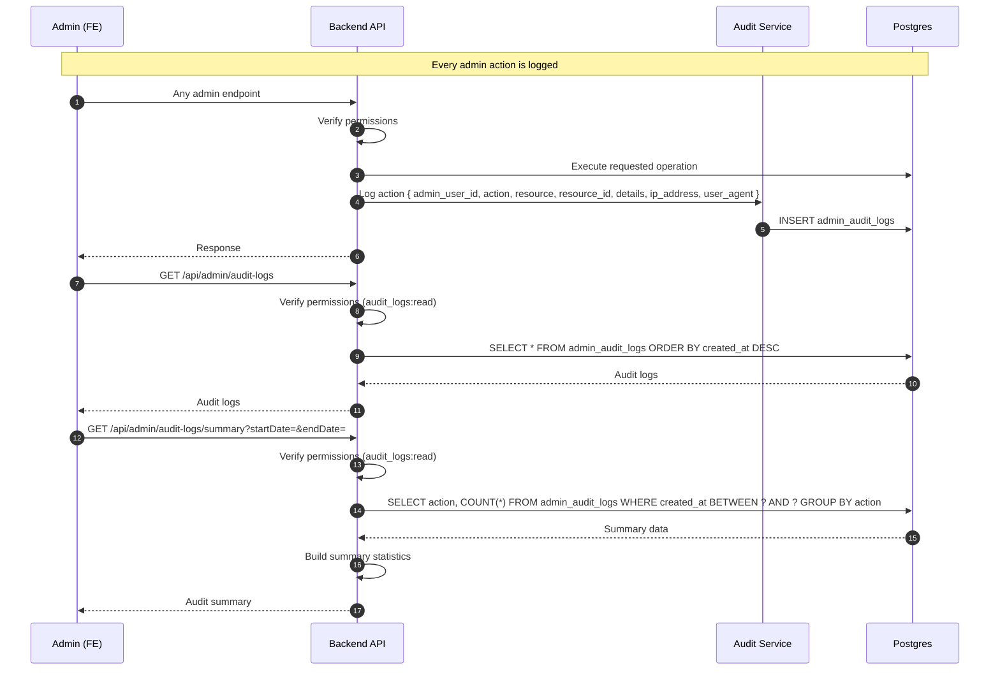
```mermaid
sequenceDiagram
  autonumber
  participant ADM as Admin (FE)
  participant API as Backend API
  participant AUDIT as Audit Service
  participant DB as Postgres

  Note over ADM,DB: Every admin action is logged
  ADM->>API: Any admin endpoint
  API->>API: Verify permissions
  API->>DB: Execute requested operation
  API->>AUDIT: Log action { admin_user_id, action, resource, resource_id, details, ip_address, user_agent }
  AUDIT->>DB: INSERT admin_audit_logs
  API-->>ADM: Response

  ADM->>API: GET /api/admin/audit-logs
  API->>API: Verify permissions (audit_logs:read)
  API->>DB: SELECT * FROM admin_audit_logs ORDER BY created_at DESC
  DB-->>API: Audit logs
  API-->>ADM: Audit logs

  ADM->>API: GET /api/admin/audit-logs/summary?startDate=&endDate=
  API->>API: Verify permissions (audit_logs:read)
  API->>DB: SELECT action, COUNT(*) FROM admin_audit_logs WHERE created_at BETWEEN ? AND ? GROUP BY action
  DB-->>API: Summary data
  API->>API: Build summary statistics
  API-->>ADM: Audit summary
```

---

## Admin Module — Prelist Management

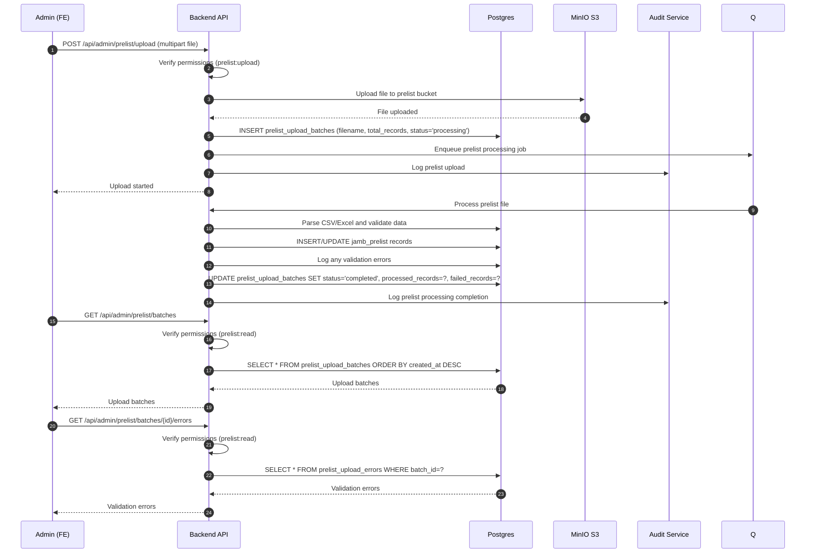
```mermaid
sequenceDiagram
  autonumber
  participant ADM as Admin (FE)
  participant API as Backend API
  participant DB as Postgres
  participant MINIO as MinIO S3
  participant AUDIT as Audit Service

  ADM->>API: POST /api/admin/prelist/upload (multipart file)
  API->>API: Verify permissions (prelist:upload)
  API->>MINIO: Upload file to prelist bucket
  MINIO-->>API: File uploaded
  API->>DB: INSERT prelist_upload_batches (filename, total_records, status='processing')
  API->>Q: Enqueue prelist processing job
  API->>AUDIT: Log prelist upload
  API-->>ADM: Upload started

  Q->>API: Process prelist file
  API->>DB: Parse CSV/Excel and validate data
  API->>DB: INSERT/UPDATE jamb_prelist records
  API->>DB: Log any validation errors
  API->>DB: UPDATE prelist_upload_batches SET status='completed', processed_records=?, failed_records=?
  API->>AUDIT: Log prelist processing completion

  ADM->>API: GET /api/admin/prelist/batches
  API->>API: Verify permissions (prelist:read)
  API->>DB: SELECT * FROM prelist_upload_batches ORDER BY created_at DESC
  DB-->>API: Upload batches
  API-->>ADM: Upload batches

  ADM->>API: GET /api/admin/prelist/batches/{id}/errors
  API->>API: Verify permissions (prelist:read)
  API->>DB: SELECT * FROM prelist_upload_errors WHERE batch_id=?
  DB-->>API: Validation errors
  API-->>ADM: Validation errors
```

---

Render notes:

- GitHub and many Markdown engines render Mermaid automatically. If not, paste each block into a Mermaid-capable viewer (e.g., https://mermaid.live) or enable Mermaid in your docs site.
